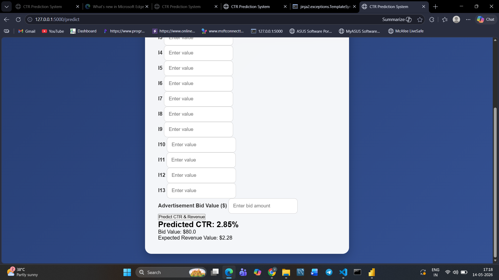
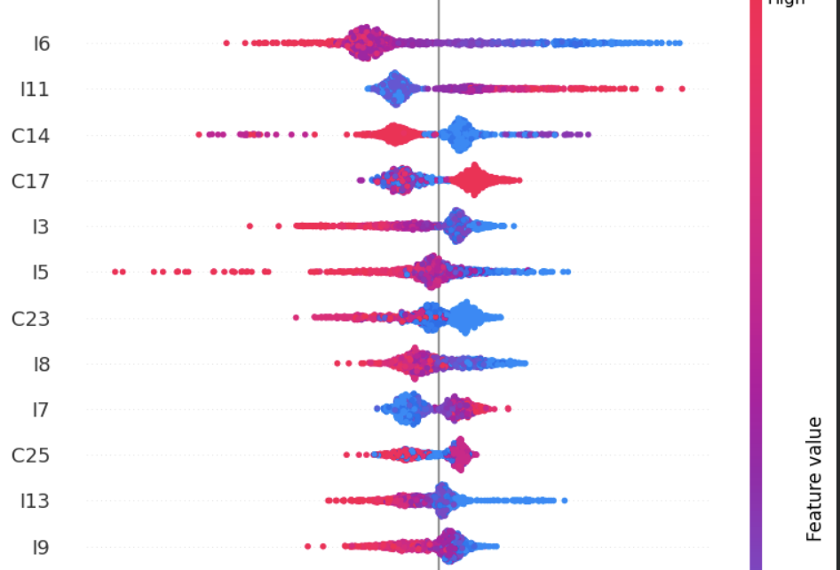
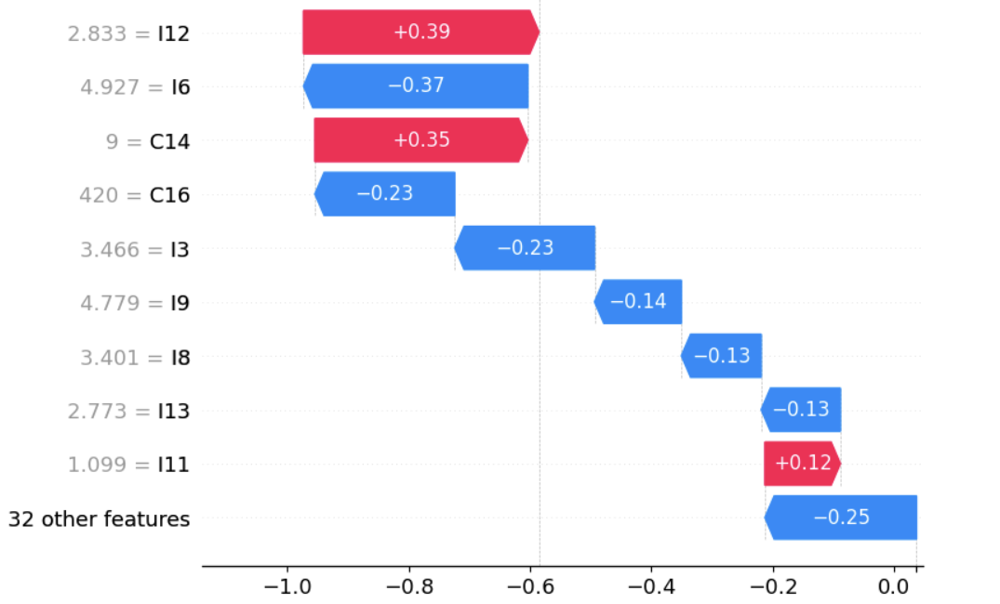
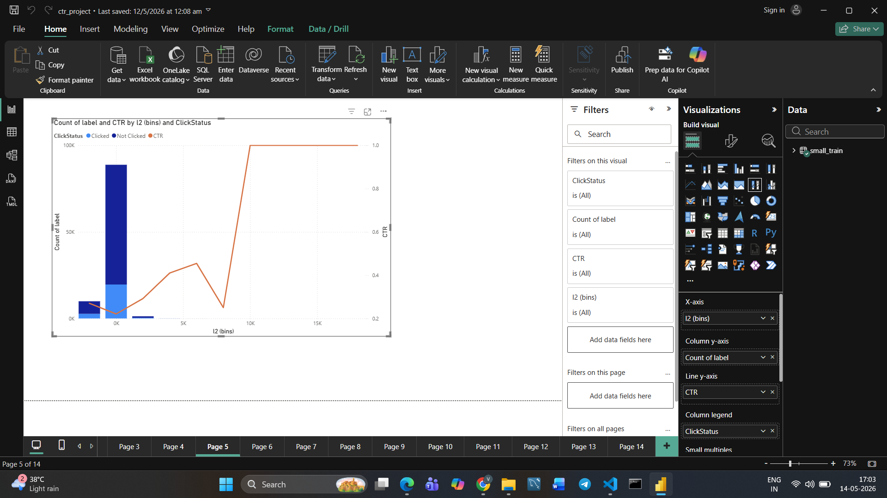

# CTR Prediction System

An end-to-end Machine Learning project for predicting Advertisement Click Through Rate (CTR) using the Criteo dataset.

---

# Project Overview

This project predicts the probability of a user clicking on an advertisement using Machine Learning.

The system also estimates:
- expected advertisement revenue,
- bidding value effectiveness,
- click probability ranking.

The project covers:
- Exploratory Data Analysis (EDA)
- Feature Engineering
- Missing Value Analysis
- Threshold Tuning
- XGBoost Modeling
- SHAP Explainability
- Flask Deployment
- Revenue Estimation Logic

---

# Business Problem

CTR prediction systems are heavily used in:
- Google Ads
- Meta Ads
- YouTube Ads
- Recommendation Systems
- Real-time Ad Bidding Platforms

This project simulates how advertisement systems estimate:
- probability of user clicks,
- expected revenue from advertisements,
- ad ranking effectiveness.

CTR prediction helps improve:
- Ad targeting
- Revenue generation
- User engagement
- Recommendation quality

---

# Dataset

Dataset Used:
- Criteo CTR Prediction Dataset

Features:
- 13 Numerical Features
- 26 Categorical Features
- Binary Target Label

Target:
- 1 → Clicked
- 0 → Not Clicked

---

# Exploratory Data Analysis

Performed:
- Null value analysis
- CTR variation analysis
- Feature importance exploration
- Numerical vs categorical analysis
- Missingness signal analysis
- Power BI visualizations

Key Findings:
- Missing values themselves carried predictive signal
- Numerical features contributed strongly to prediction
- Some categorical features showed weak standalone signal
- Feature importance aligned with behavioral patterns

---

# Machine Learning Workflow

```text
EDA
→ Data Cleaning
→ Missing Value Handling
→ Encoding
→ Feature Engineering
→ Logistic Regression Baseline
→ Threshold Tuning
→ XGBoost Modeling
→ SHAP Explainability
→ Flask Deployment
```

---

# Models Used

## Logistic Regression
Used as baseline model for comparison.

## XGBoost
Used for final optimized prediction model.

---

# Model Performance

| Model | ROC-AUC Score |
|------|------|
| Logistic Regression | 0.62 |
| XGBoost | 0.76 |

---

# Revenue Estimation Logic

The deployed system estimates expected advertisement revenue using:

```text
Expected Value = CTR Probability × Bid Value
```

Example:
- Predicted CTR = 65%
- Advertisement Bid = $10

Expected Revenue Value:

```text
0.65 × 10 = $6.5
```

This simulates simplified real-world advertisement bidding systems.

---

# Flask Deployment

Built a web application where users can:
- Input numerical feature values
- Predict click probability
- Estimate expected advertisement revenue
- Interact with trained ML model through browser

---

# Application UI

## CTR Prediction Interface


---

## Revenue Estimation Interface



---

# SHAP Explainability

## SHAP Feature Importance



---

## SHAP Summary Plot



---

# Power BI Dashboard

## Dashboard Overview



---

## Missing Value Analysis


---

## Unique Categorical Feature Analysis


---

# Technologies Used

- Python
- Pandas
- NumPy
- Scikit-learn
- XGBoost
- SHAP
- Flask
- HTML
- CSS
- Power BI

---

# Future Improvements

- Real-time bidding optimization
- Deep Learning CTR models
- User behavior tracking
- Recommendation engine integration
- Docker deployment
- Cloud deployment

---

# Project Structure

```text
CTR_Prediction_App/
│
├── app.py
├── model.pkl
├── requirements.txt
│
├── templates/
│   └── index.html
│
├── static/
│   └── style.css
│
├── screenshots/
│   ├── Application_UI_1.png
│   ├── Application_UI_2.png
│   ├── Power_BI_dashboard_1.png
│   ├── Power_BI_missing_values.png
│   ├── Power_BI_unique-categorical_values.png
│   ├── SHAP_1.png
│   └── SHAP_2.png
│
└── README.md
```

---

# Key Learnings

- Handling imbalanced datasets
- ROC-AUC interpretation
- Precision vs Recall tradeoff
- Threshold tuning for business objectives
- Feature importance analysis
- Explainable AI using SHAP
- End-to-end ML deployment using Flask
- Revenue estimation logic in ad systems

---

# Author

V Satya Vivek